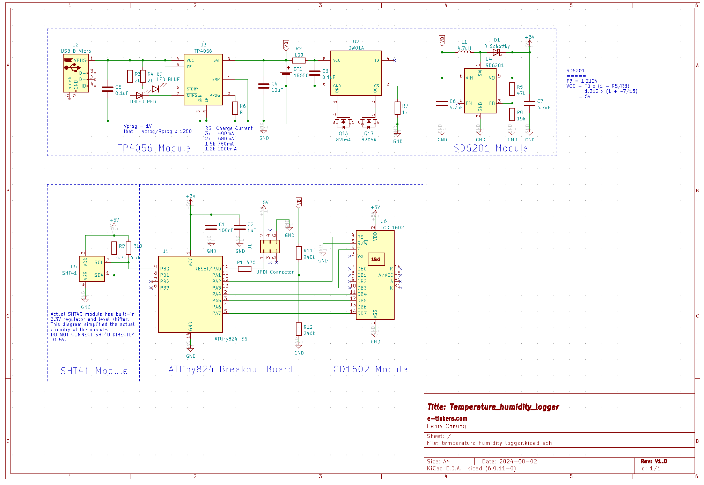

## SHT40 Temperature and Humidity Monitor
This is just another weekend project. I need a temperature and humidity monitor, instead of buying one from Ikea, I decided to make one with a Sensirion SHT40 sensor and a ATtiny824 MCU. 

Here is the schematic, but I didn't create it with each of the components and a custom PCB from scratch this time. I used 5 ready-made modules to put it together. With except of ATtiny824 breakout board which I made myself a couple of years ago, the rest of 4 modules are bought from Aliexpress in the past.

The main PCB consists of the ATtiny824 module and SHT40 breakout module soldered on a prototype board, and then mounted on the back of LCD1602 display module as shown [here](images/main_pcb_mounted_on_back_of_LCD1602.png). 

The Power Supply sub-system consists of a TP4056 Li-Ion charger and 18650 battery protection circuitry, and a SD6201-based boost converter. Both are soldered on a prototype board which is used as the base for a 18650 battery holder as shown [here](images/TP4056_and_SD6201_mounted_on_back_of_18650_battery_holder.png).

As I know nothing about 3D printing and mechanical design, and don't have a 3D printer either, so I make wooden box with pine board that I bought from Daiso for 200 yen.

## Software
The code is trivia and is written in ATtiny824 bare metal style, it read the temperature and humidity once every 1 minute and go back to Power Down sleep mode. In addition to read the temperature and humidity data from the SHT40, the battery voltage is read via a voltage divider for monitoring when the battery would need to be charged.

The LCD1602.h and I2C.h are driver code that I wrote and can be re-used for other projects. It is in fact took longer to write those drivers than put together the main code.

The complete source is available at https://github.com/e-tinkers/sht40-temperature-humidity.

## Battery Consumption
The power consumption is around 1.26mA, with a 18650 battery of 2200mAh capacity, it is estimated to last for about 72 days for a single charge. Among the 1.26mA, the LCD1602 consumed about 450uA, the rest is from the ATtiny824 and the SD6201. The MCU is running at 20MHz and consumed about 10mA during wake-up period, and this could be reduced by running at lower clock speed, the SD1601 boost converter can be further improved to reduce it leakage and quiescent current, but I'm happy with the 72 days battery life so I leave every module as is without any modification.

## Resources
- [SHT40 Datasheet](https://sensirion.com/media/documents/33FD6951/6555C40E/Sensirion_Datasheet_SHT4x.pdf)
- [ATtiny824 Datasheet](https://ww1.microchip.com/downloads/aemDocuments/documents/MCU08/ProductDocuments/DataSheets/ATtiny424-426-427-824-826-827-DataSheet-DS40002311B.pdf)
- [TP4056 Datasheet (Chinese)](http://www.tp-asic.com/res/tp-asic/pdres/201802/TP4056X.pdf)
- [SD6201 Datasheet](https://www.lcsc.com/datasheet/lcsc_datasheet_1804250821_SHOUDING-SD6201-AF_C171633.pdf)

